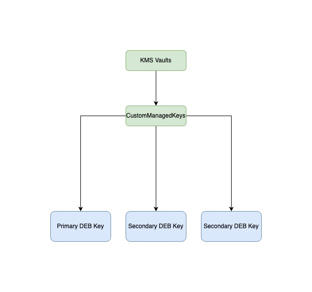

# CSFLE Setup on MongoDB Atlas

## Introduction

This guide will walk you through the process of setting up Client-Side Field Level Encryption (CSFLE) on MongoDB Atlas. CSFLE ensures that sensitive data is encrypted on the client side before being sent to the server, providing an additional layer of security.

## Prerequisites

Before you begin, ensure you have the following:

- A MongoDB Atlas account
- A MongoDB Atlas cluster
- Node.js installed on your local machine
- `npm` (Node Package Manager) installed
- A local environment for running a Node.js application

## Step 1: Set Up MongoDB Atlas

1. **Create a MongoDB Atlas Cluster:**
   - Go to [MongoDB Atlas](https://www.mongodb.com/cloud/atlas) and log in.
   - Create a new cluster if you don't have one already.

2. **Create a Database and Collection:**
   - Navigate to your cluster.
   - Click on "Collections" and add a new database and collection.

3. **Create a Key Vault:**
   - You need to create a key vault for storing encryption keys.
   - In the MongoDB Atlas UI, create a collection named `__keyVault` in a database of your choice (e.g., `encryption`).

## Step 2: Prepare Your Local Environment

1. **Clone the Repository:**
   - Clone the repository containing the Node.js application that will use CSFLE.
   - Navigate to the project directory.
   - In this project you can observe that you have root folder as CSFLE which contains
   -    Crypto-js , Server-node
  

## Crypto-js

**Customer Managed Keys (CMK)** are encryption keys that customers control within a cloud service provider's environment, offering a higher level of security and oversight over their data. Unlike default keys provided by the cloud provider, CMK allows organizations to generate, manage, and control their encryption keys, ensuring alignment with internal security policies and regulatory compliance. This level of control enhances data protection by enabling key rotation, access control, and audit logging, ultimately providing greater confidence in the security of sensitive information.




   - This directory contains the local setup of credentials required for Client-Side Field Level Encryption. Please note that this **local setup should not be used in a production 
     environment**, as a file-based approach can pose significant risks.
   

2. **Install Dependencies:**
   ```bash
   npm install
