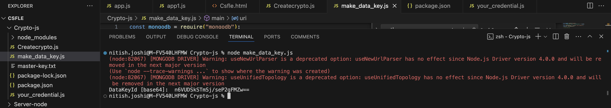
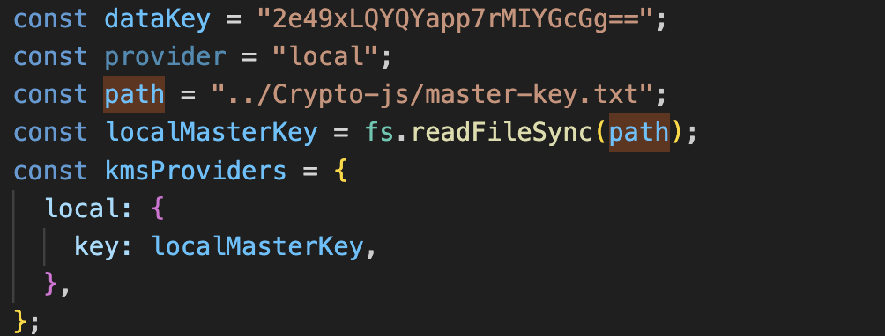
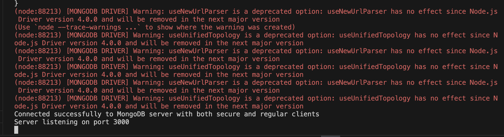
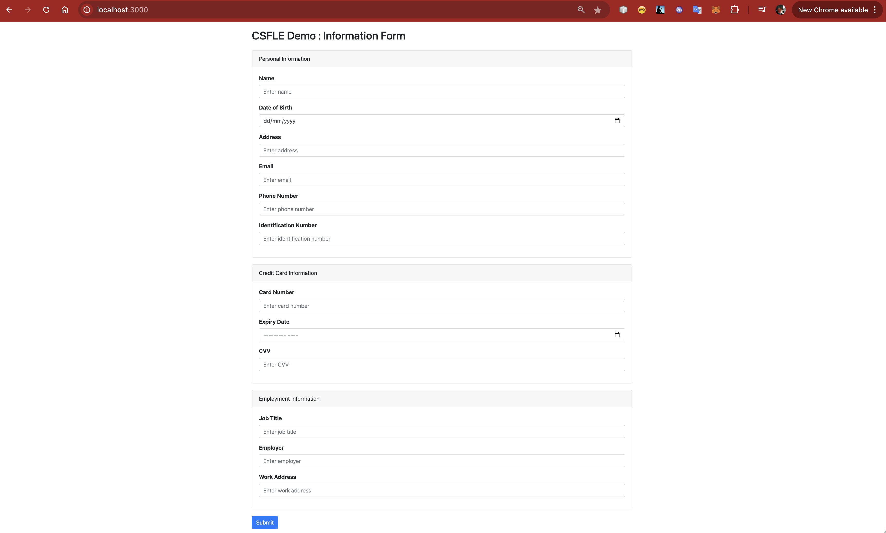

# File Based CSFLE Setup For MongoDB Atlas

## Introduction

This guide will walk you through the process of setting up Client-Side Field Level Encryption (CSFLE) on MongoDB Atlas. CSFLE ensures that sensitive data is encrypted on the client side before being sent to the server, providing an additional layer of security.

## Prerequisites

Before you begin, ensure you have the following:

- A MongoDB Atlas account
- A MongoDB Atlas cluster
- Node.js installed on your local machine
- `npm` (Node Package Manager) installed
- A local environment for running a Node.js application

## Step 1: Set Up MongoDB Atlas

1. **Create a MongoDB Atlas Cluster:**
   - Go to [MongoDB Atlas](https://www.mongodb.com/cloud/atlas) and log in.
   - Create a new cluster if you don't have one already.

2. **Create a Database and Collection:**
   - Navigate to your cluster.
   - Click on "Collections" and add a new database and collection.
  
3. **Install Dependencies:**
   ```bash
   npm install


## Step 2: Prepare Your Local Environment

1. **Clone the Repository:**
   - Clone the repository containing the Node.js application that will use CSFLE.
   - Navigate to the project directory.
   - In this project you can observe that you have root folder as CSFLE which contains
   -    Crypto-js , Server-node
  

## Crypto-js

**Customer Managed Keys (CMK)** are encryption keys that customers control within a cloud service provider's environment, offering a higher level of security and oversight over their data. Unlike default keys provided by the cloud provider, CMK allows organizations to generate, manage, and control their encryption keys, ensuring alignment with internal security policies and regulatory compliance. This level of control enhances data protection by enabling key rotation, access control, and audit logging, ultimately providing greater confidence in the security of sensitive information.


Deterministic Encryption-Based (DEB) keys and Customer-Managed Keys (CMKs) in MongoDB work together to provide tailored data security. DEB keys are used for deterministic encryption, ensuring that the same plaintext always results in the same ciphertext, which facilitates exact value searches and indexing. CMKs, managed by the customer through a Key Management Service (KMS), offer broader control over encryption key lifecycle, including rotation and access. DEB keys can be a type of CMK, allowing organizations to use predictable encryption methods while maintaining control over key management. Essentially, CMKs encompass all types of encryption keys, including DEB keys, to ensure comprehensive and compliant data protection.


This directory contains the local setup of credentials required for Client-Side Field Level Encryption. Please note that this **local setup should not be used in a production  environment**, as a file-based approach can pose significant risks.  

## Generation of DEB Key in File Based Setup

1. Go to Directory /CSFLE/Crypto-js.
2. Open your terminal on Visual Studio code or outside of it.
3. Look for **your_credential.js** and run node your_credential.js (**Please make sure you have pre configured your connection string inside it.**)



4. Carefully copy the DEBKey from your terminal , which we can use it in the main server code to encrypt the specific field.
5. As you will get the copy of your key , Please verify that on atlas you should see new database and collection related to keyvault which looks as following.


 

## Setting Up Server.js

1. DEB key copied from previous section , place it in your server.js as below
 


2. Make sure your schema is in place with the Algorithm of your choice , for this demo I am using simple schema which is as following

```javascript 
const schema = {
  bsonType: "object",
  encryptMetadata: {
    keyId: [new Binary(Buffer.from(dataKey, "base64"), 4)],
  },
  properties: {
    Full_Name: {
      encrypt: {
        bsonType: "string",
        algorithm: "AEAD_AES_256_CBC_HMAC_SHA_512-Random",
      },
    },
    DOB: {
      encrypt: {
        bsonType: "string",
        algorithm: "AEAD_AES_256_CBC_HMAC_SHA_512-Random",
      },
    },
    Address: {
      encrypt: {
        bsonType: "string",
        algorithm: "AEAD_AES_256_CBC_HMAC_SHA_512-Random",
      },
    },
    Email: {
      encrypt: {
        bsonType: "string",
        algorithm: "AEAD_AES_256_CBC_HMAC_SHA_512-Random",
      },
    },
    phone_number: {
      encrypt: {
        bsonType: "string",
        algorithm: "AEAD_AES_256_CBC_HMAC_SHA_512-Random",
      },
    },
    Identification_number: {
      encrypt: {
        bsonType: "string",
        algorithm: "AEAD_AES_256_CBC_HMAC_SHA_512-Random",
      },
    },
    cardnumber: {
      encrypt: {
        bsonType: "string",
        algorithm: "AEAD_AES_256_CBC_HMAC_SHA_512-Random",
      },
    },
    Expirydate: {
      encrypt: {
        bsonType: "string",
        algorithm: "AEAD_AES_256_CBC_HMAC_SHA_512-Random",
      },
    },
    JobTitle: {
      encrypt: {
        bsonType: "string",
        algorithm: "AEAD_AES_256_CBC_HMAC_SHA_512-Random",
      },
    },
    employer: {
      encrypt: {
        bsonType: "string",
        algorithm: "AEAD_AES_256_CBC_HMAC_SHA_512-Random",
      },
    },
    workaddress: {
      encrypt: {
        bsonType: "string",
        algorithm: "AEAD_AES_256_CBC_HMAC_SHA_512-Random",
      },
    },
    expirydate: {
      encrypt: {
        bsonType: "string",
        algorithm: "AEAD_AES_256_CBC_HMAC_SHA_512-Random",
      },
    },
    cvv: {
      encrypt: {
        bsonType: "string",
        algorithm: "AEAD_AES_256_CBC_HMAC_SHA_512-Random",
      },
    },
  },
};
```

3. You can choose either Deterministic or Random , which may vary according to the requirement.
4. If you have done all the settings till now we are ready to test the application.

### Runtime of Application

1. Start the Server, Please ignore the warnings if you it is showing up to you as well.



2. As soon you get the **server started on 3000** message , Open web browser.
3. Copy pase this URL , http://localhost:3000/



4. Please enter all the field , Most of the fields are in string format except Dates.
5. Enter Submit
6. Spesified fields according to the schema will get encrypted on the database as shwon below

![Project Logo] (images/CSFLE_Database.png)
